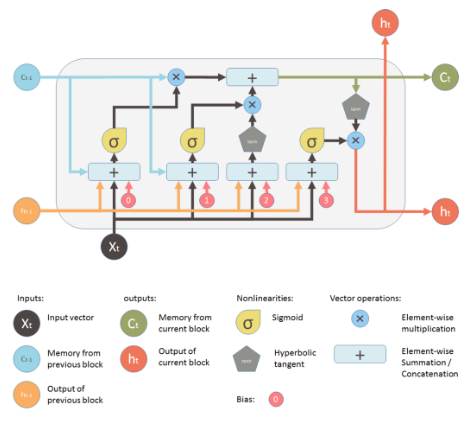
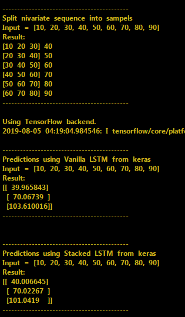

# LSTM Time Series Forecast Models
```diff  
LSTM THEORY 

The key to LSTMs is the cell state, the horizontal line running through the top of the diagram.
It’s very easy for information to just flow along it unchanged.
The LSTM does have the ability to remove or add information to the cell state, carefully regulated by structures called gates.
Gates are a way to optionally let information through. They are composed out of a sigmoid neural net layer and a pointwise multiplication operation.
An LSTM has three of these gates, to protect and control the cell state.
```


## Steps to run environment
```diff  
WIN 10 64 - workign packages versions
numpy==1.16 
pandas==0.22.0
setuptools==41.0.0

try:
    pip install --upgrade --force-reinstall numpy==1.14.5
    pip install --upgrade --force-reinstall pandas==0.22.0
or: 
    pip show #package and delete os global version
```


